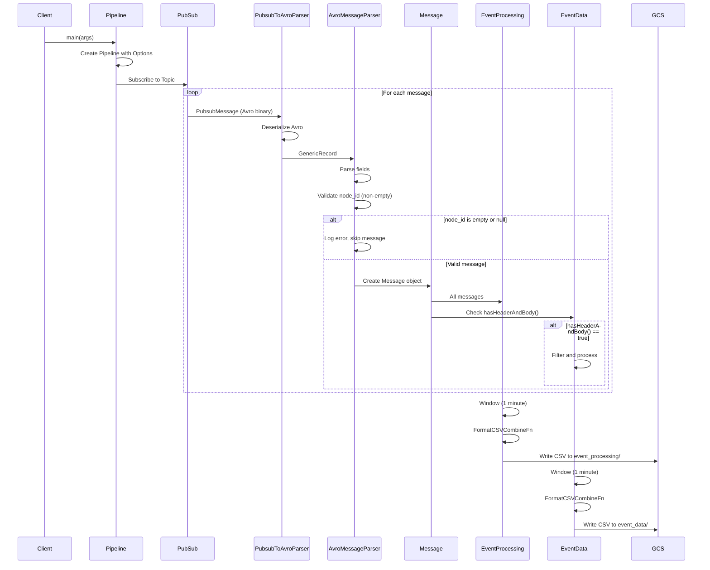
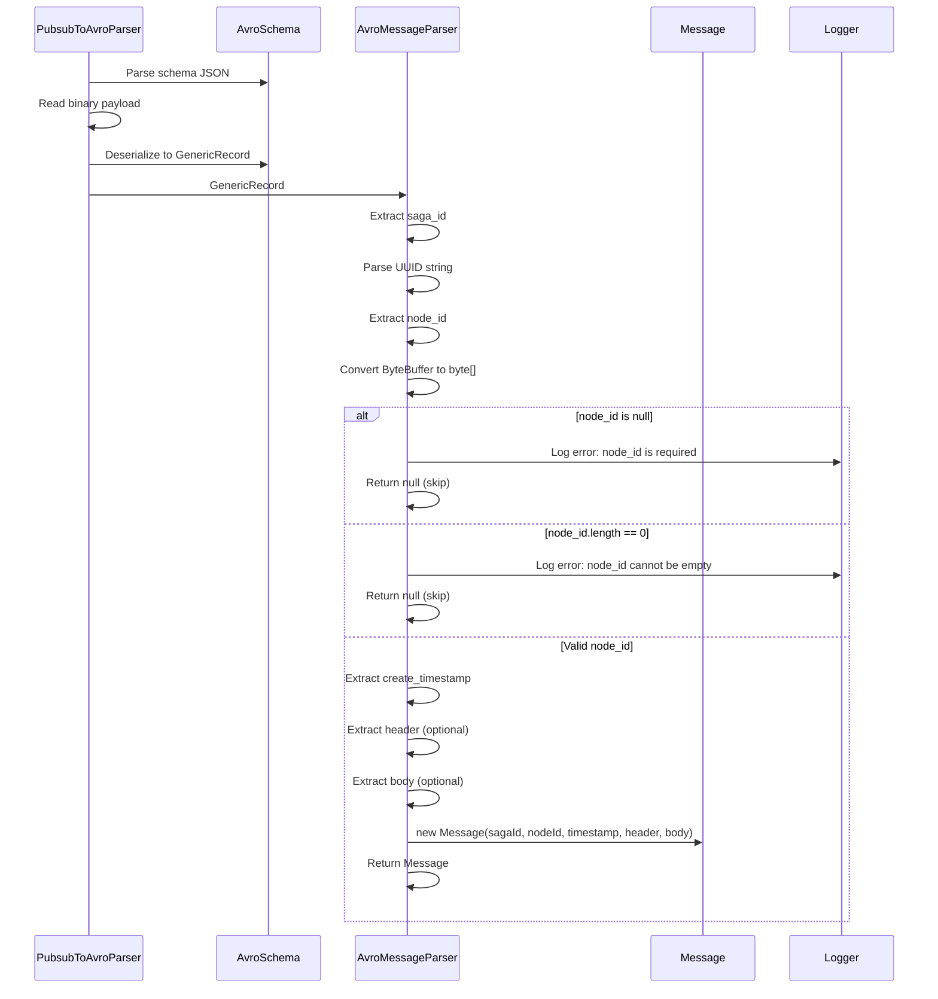
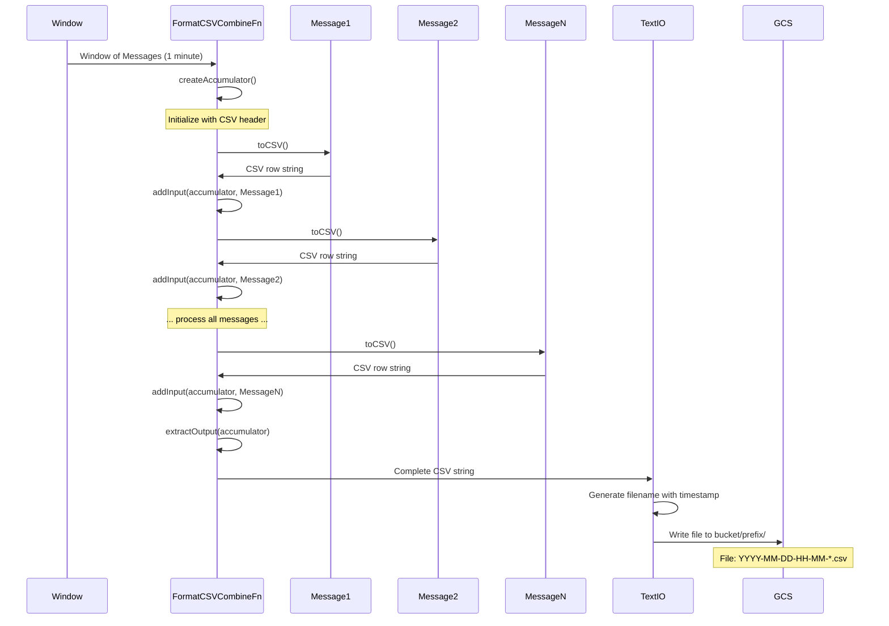
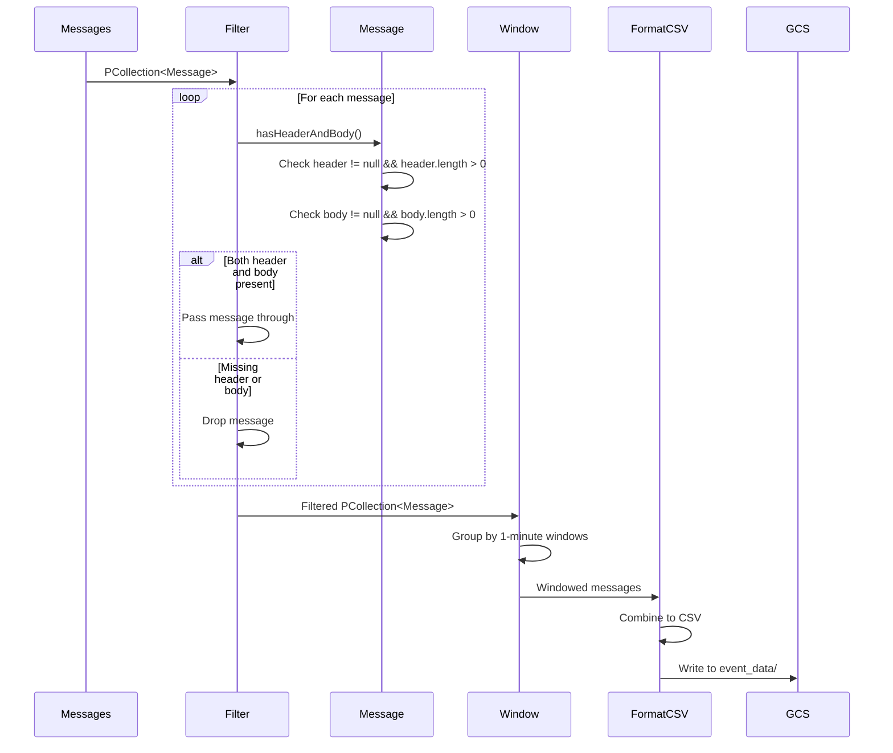

# PubSub to GCS Beam Pipeline - Design Document

## Table of Contents
1. [High-Level Design](#high-level-design)
2. [Low-Level Design](#low-level-design)
3. [Sequence Diagrams](#sequence-diagrams)
4. [Design Decisions](#design-decisions)

---

## High-Level Design

### System Overview

The PubSub to GCS Beam Pipeline is a streaming data processing system that:
- Consumes messages from Google Cloud Pub/Sub in Avro format
- Parses and validates message data
- Transforms messages into CSV format
- Writes processed messages to Google Cloud Storage (GCS) in two separate paths based on message content

### Architecture Diagram

```
┌─────────────────┐
│   GCP Pub/Sub   │
│   Subscription  │
└────────┬────────┘
         │
         │ Avro Messages
         ▼
┌─────────────────────────────────────────┐
│      Apache Beam Pipeline               │
│                                         │
│  ┌──────────────────────────────────┐  │
│  │  PubsubToAvroParser              │  │
│  │  - Deserializes Avro binary      │  │
│  │  - Validates schema              │  │
│  └──────────────┬───────────────────┘  │
│                 │                       │
│                 ▼                       │
│  ┌──────────────────────────────────┐  │
│  │  AvroMessageParser                │  │
│  │  - Parses GenericRecord           │  │
│  │  - Validates node_id (non-empty) │  │
│  │  - Converts to Message object     │  │
│  └──────────────┬───────────────────┘  │
│                 │                       │
│                 ▼                       │
│         ┌───────┴───────┐              │
│         │               │              │
│         ▼               ▼              │
│  ┌─────────────┐  ┌─────────────┐     │
│  │  Event      │  │  Event      │     │
│  │  Processing │  │  Data       │     │
│  │  Path       │  │  Path       │     │
│  └──────┬──────┘  └──────┬──────┘     │
│         │                │            │
│         │ Filter:        │            │
│         │ All messages   │            │
│         │                │            │
│         │                │ Filter:    │
│         │                │ hasHeader  │
│         │                │ AndBody    │
└─────────┼────────────────┼────────────┘
          │                │
          │                │
          ▼                ▼
┌─────────────────┐  ┌─────────────────┐
│   GCS Bucket     │  │   GCS Bucket     │
│ event_processing/│  │   event_data/    │
│   *.csv files    │  │   *.csv files    │
└─────────────────┘  └─────────────────┘
```

### Key Components

1. **PubsubToGCSPipeline** - Main pipeline orchestrator
2. **PubsubToAvroParser** - Converts PubSub messages to Avro GenericRecord
3. **AvroMessageParser** - Parses Avro records to Message objects
4. **Message** - Domain model representing message data
5. **FormatCSVCombineFn** - Combines messages into CSV format
6. **TextIO** - Writes CSV data to GCS

### Data Flow

```
PubSub Message (Avro Binary)
    ↓
PubsubToAvroParser (Deserialize)
    ↓
GenericRecord (Avro)
    ↓
AvroMessageParser (Parse & Validate)
    ↓
Message Object
    ↓
    ├─→ Event Processing Path (All Messages)
    │       ↓
    │   Window (1 minute)
    │       ↓
    │   FormatCSVCombineFn
    │       ↓
    │   GCS: event_processing/YYYY-MM-DD-HH-MM-*.csv
    │
    └─→ Event Data Path (Header & Body Present)
            ↓
        Filter (hasHeaderAndBody)
            ↓
        Window (1 minute)
            ↓
        FormatCSVCombineFn
            ↓
        GCS: event_data/YYYY-MM-DD-HH-MM-*.csv
```

---

## Low-Level Design

### Component Details

#### 1. PubsubToGCSPipeline

**Purpose**: Main entry point and pipeline orchestrator

**Key Methods**:
- `main(String[] args)` - Pipeline entry point
- `writeEventProcessing()` - Handles all messages path
- `writeEventData()` - Handles filtered messages path

**Pipeline Options**:
- `inputSubscription` - Pub/Sub subscription path
- `outputBucket` - GCS bucket for output files
- `outputPathPrefix` - Optional prefix for output paths

#### 2. PubsubToAvroParser

**Purpose**: Converts PubSubMessage payload to Avro GenericRecord

**Key Responsibilities**:
- Deserializes Avro binary data from PubSub message payload
- Validates against Avro schema
- Handles empty payloads gracefully

**Avro Schema**:
```json
{
  "type": "record",
  "name": "MessageRecord",
  "fields": [
    {"name": "saga_id", "type": "string"},           // Required
    {"name": "node_id", "type": "bytes"},            // Required, non-empty
    {"name": "create_timestamp", "type": "long"},    // Required
    {"name": "header", "type": ["null", "bytes"]},   // Optional
    {"name": "body", "type": ["null", "bytes"]}      // Optional
  ]
}
```

#### 3. AvroMessageParser

**Purpose**: Parses Avro GenericRecord to Message domain object

**Key Responsibilities**:
- Extracts fields from GenericRecord
- Validates node_id is non-empty
- Handles ByteBuffer to byte[] conversion
- Converts UUID strings to UUID objects
- Handles type conversions (Integer to Long for timestamps)

**Validation Rules**:
- `saga_id`: Required, must be valid UUID string
- `node_id`: Required, must be non-empty byte array
- `create_timestamp`: Required, must be numeric
- `header`: Optional, nullable
- `body`: Optional, nullable

#### 4. Message

**Purpose**: Domain model for message data

**Fields**:
- `sagaId` (UUID)
- `nodeId` (byte[])
- `createTimestamp` (long)
- `header` (byte[])
- `body` (byte[])

**Key Methods**:
- `hasHeaderAndBody()` - Checks if both header and body are non-empty
- `toCSV()` - Converts message to CSV format with proper escaping

#### 5. FormatCSVCombineFn

**Purpose**: Combines multiple Message objects into a single CSV string

**Operations**:
- Creates accumulator with CSV header
- Appends each message as CSV row
- Merges multiple accumulators (removes duplicate headers)
- Returns final CSV string

### Processing Flow Details

#### Event Processing Path (All Messages)

1. **Assign Timestamps**: Assigns event timestamps based on `createTimestamp`
2. **Window**: Fixed windows of 1 minute duration
3. **Format CSV**: Combines all messages in window into CSV format
4. **Write to GCS**: Writes to `event_processing/` prefix with timestamp-based filenames

#### Event Data Path (Filtered Messages)

1. **Filter**: Only messages where both `header` and `body` are non-empty
2. **Assign Timestamps**: Assigns event timestamps based on `createTimestamp`
3. **Window**: Fixed windows of 1 minute duration
4. **Format CSV**: Combines all messages in window into CSV format
5. **Write to GCS**: Writes to `event_data/` prefix with timestamp-based filenames

### Window Strategy

- **Type**: Fixed Windows
- **Duration**: 1 minute
- **Purpose**: Batch messages by minute for efficient file writing
- **Timestamp**: Based on `create_timestamp` field truncated to minute precision

### File Naming Convention

Files are named using window timestamps:
- Format: `YYYY-MM-DD-HH-MM-*.csv`
- Example: `2024-12-19-14-30-00000-of-00001.csv`
- Location: `gs://bucket/event_processing/` or `gs://bucket/event_data/`

---

## Sequence Diagrams

### 1. Pipeline Initialization and Message Processing



### 2. Message Parsing and Validation



### 3. CSV Formatting and File Writing



### 4. Event Data Filtering Flow



---

## Design Decisions

### 1. Apache Beam Framework

**Decision**: Use Apache Beam for stream processing

**Rationale**:
- Unified batch and streaming API
- Supports multiple runners (DirectRunner, DataflowRunner)
- Built-in windowing and state management
- Native GCP integration (Pub/Sub, GCS)

### 2. Avro Format

**Decision**: Use Avro for message serialization

**Rationale**:
- Compact binary format
- Schema evolution support
- Type safety
- Efficient serialization/deserialization

### 3. Fixed Windows (1 minute)

**Decision**: Use 1-minute fixed windows for batching

**Rationale**:
- Balances latency and throughput
- Reduces number of files created
- Aligns with timestamp truncation requirement
- Efficient for downstream processing

### 4. Two Output Paths

**Decision**: Separate paths for all messages vs. filtered messages

**Rationale**:
- Clear separation of concerns
- Different consumers may need different data
- Allows independent scaling and processing
- Maintains audit trail (all messages) while providing filtered view

### 5. CSV Output Format

**Decision**: Use CSV for output files

**Rationale**:
- Human-readable
- Widely supported by analytics tools
- Easy to parse and process
- Efficient for structured data

### 6. Validation at Parser Level

**Decision**: Validate node_id non-empty in AvroMessageParser

**Rationale**:
- Avro schema cannot enforce non-empty constraint
- Early validation prevents invalid data downstream
- Clear error logging for debugging
- Graceful error handling (skip invalid messages)

### 7. Timestamp-Based File Naming

**Decision**: Use truncated timestamp in filenames

**Rationale**:
- Enables time-based file discovery
- Supports partitioning strategies
- Aligns with windowing strategy
- Easy to identify file time range

### 8. Combine Function for CSV

**Decision**: Use Combine.globally() for CSV formatting

**Rationale**:
- Efficient aggregation within windows
- Handles header correctly (once per file)
- Scalable for large message volumes
- Maintains order within windows

### 9. Error Handling Strategy

**Decision**: Log errors and skip invalid messages

**Rationale**:
- Prevents pipeline failures from bad data
- Maintains processing of valid messages
- Provides audit trail through logs
- Can be enhanced with dead-letter queue if needed

### 10. Serializable Message Class

**Decision**: Make Message implement Serializable

**Rationale**:
- Required for Beam's distributed processing
- Enables stateful operations if needed
- Supports testing with DirectRunner
- Standard Java serialization pattern

---

## Performance Considerations

### Scalability
- Pipeline can scale horizontally with DataflowRunner
- Windowing allows parallel processing of time windows
- Combine function reduces data shuffling

### Throughput
- Avro binary format minimizes payload size
- Fixed windows batch writes for efficiency
- Single shard per window reduces file fragmentation

### Latency
- 1-minute windows provide acceptable latency
- Streaming processing (not batch)
- Real-time message consumption from Pub/Sub

### Cost Optimization
- Efficient Avro serialization reduces Pub/Sub costs
- Windowed writes reduce GCS API calls
- Single shard per file reduces storage overhead

---

## Future Enhancements

1. **Dead Letter Queue**: Route invalid messages to separate topic/bucket
2. **Metrics**: Add custom metrics for monitoring
3. **Schema Registry**: Externalize Avro schema for evolution
4. **Compression**: Add GZIP compression for CSV files
5. **Partitioning**: Support additional partitioning strategies
6. **Exactly-Once Processing**: Implement idempotent writes
7. **Backpressure Handling**: Add flow control for high-volume scenarios

---

## Dependencies

- Apache Beam SDK 2.50.0
- Apache Avro 1.11.3
- Google Cloud Platform libraries
- SLF4J for logging

---

## Testing Strategy

- **Unit Tests**: Test individual components (Message, Parsers)
- **Integration Tests**: Test pipeline with TestPipeline
- **Validation Tests**: Test error handling and edge cases
- **Schema Tests**: Verify Avro schema compatibility

---

*Document Version: 1.0*  
*Last Updated: 2024-12-19*

